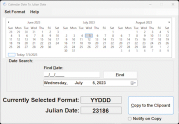

# Julian Date Selector
A tool for using a calendar date to find out the associated Julian date or using a Julian date to find a Calendar date. Then allow the user to copy the Julian date to the clipboard. The format for the Julian date is customizable from a list of formats.

## Microsoft Store Link (to Install)
[(Click here) To get the program from the Microsoft Store](https://apps.microsoft.com/detail/9NSGP4VDNW0R)

## Help Website

[Click here for the Help Website for this program](https://jamesflippin.github.io/Julian_Date_Selector/JulianDate.html)

## License 
[GNU GENERAL PUBLIC LICENSE, Version 3](https://www.gnu.org/licenses/gpl-3.0.en.html#license-text)

## Acknowledgements

#### Updates

| Release | Date     | Description                |
| :-------- | :------- | :------------------------- |
| `Initial` | `7/5/2021` | **Initial Release** |
| `Initial` | `7/4/2022` | Maintenace update |
| `Update` | `7/3/2023` | Update with 'Find' fix and ToolTips |
| `Update` | `7/7/2023` | Updates to the `About` screen adding GitHub Information |
| `Update` | `2024-2025` | Minor Updates |
| `Update` | `9/26/2025` | Added Julian Date to Calendar Date, Added End User Guide using F1 Key or Help Menu, Other functional cleanup, including better documentation |

## Author

- [@jamesflippin](https://www.github.com/jamesflippin)

## Language

Writen in the C# language.

## Demo

## Deployment/Availability (Where can I get it) 

The program is available for installation/download in the [**Microsoft Store&copy;**](https://apps.microsoft.com/detail/9NSGP4VDNW0R) 

(Search for: **'Julian Date Selector'** under apps)

## 🚀 About Me
# Hi, I'm James 👋

I'm an independant Software Developer amongst my many other Information Technology roles. 

## Other Common Github Profile Sections
👩‍💻 I'm currently working on several projects...

👯‍♀️ I'm looking to collaborate on fun and interesting projects...

📫 My email address is [james.flippin@zohomail.com](mailto://james.flippin@zohomail.com)...
